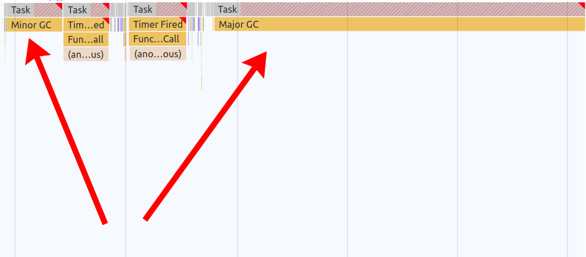
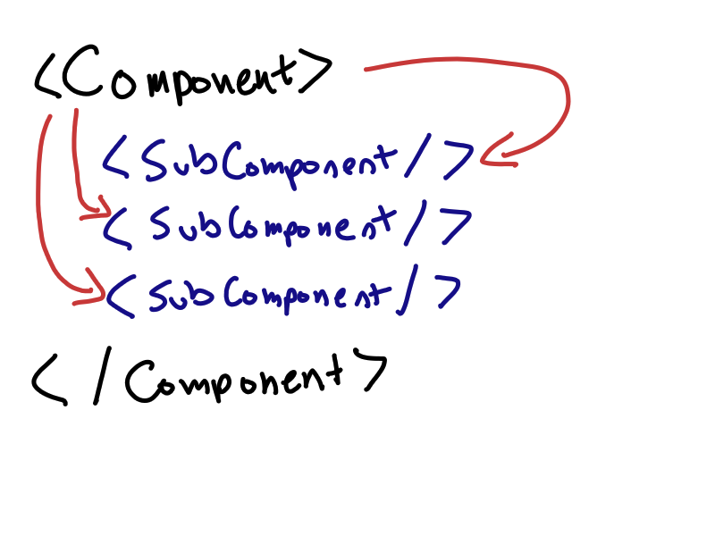
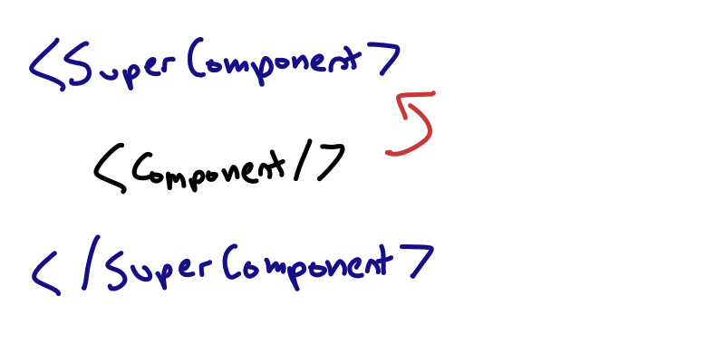
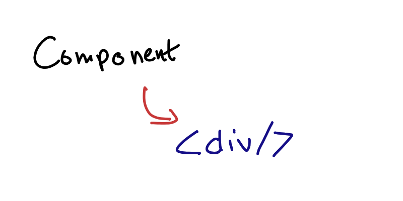
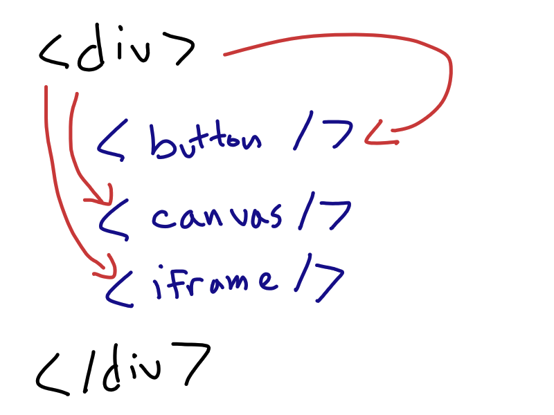
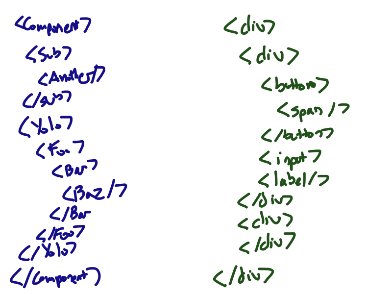
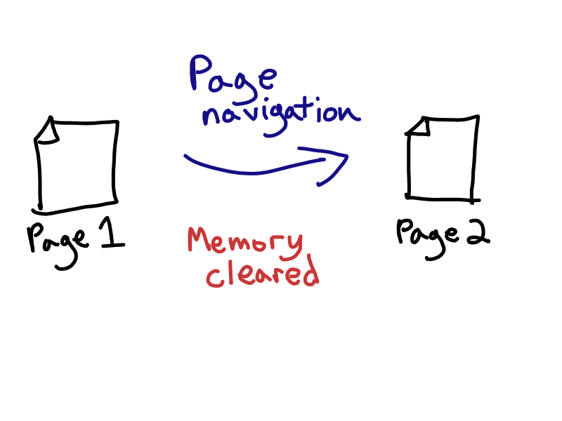
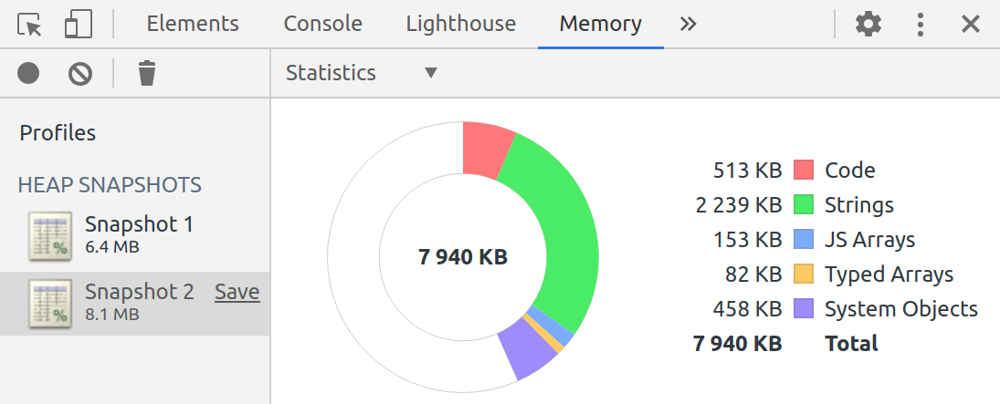
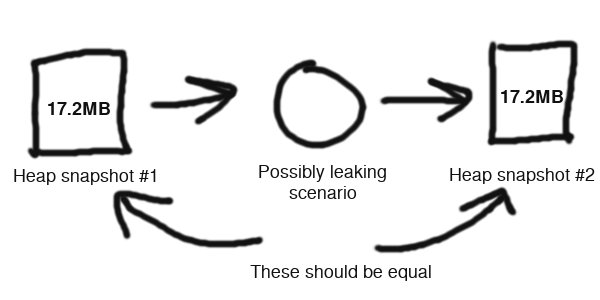
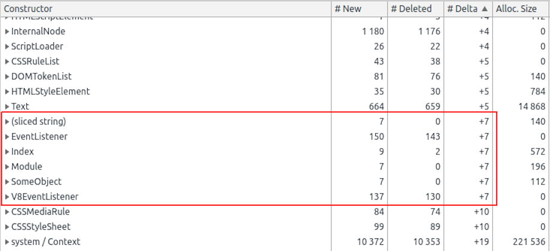

class: center, middle

# Taming memory leaks in JavaScript

## Nolan Lawson, 2020

<br/>
<br/>

###### Press P for speaker notes


???
Hi, my name is Nolan Lawson, and I'd like to talk to you about memory leaks.

<br/><br/>
---

# Nolan Lawson (me)

.center[]

???
But first off, here's the obligatory slide about me. It's kind of unfortunate to do a virtual conference,
because we don't have the same ability to meet-and-greet beforehand, but hopefully this is a decent substitute.

---

# My first JS meetup!

.center[]

???
Queens JS was actually my first JavaScript meetup ever! I moved to New York six years ago. I remember it was
summer, and my first impression of New York was the hot, sweltering garbage on the side of the road. Later on,
I would get to know the mosquitoes that would sneak into my apartment late at night.

But you know what? I still miss the New York summers. I live in Seattle now, where the weather is kind of blah
all year round (although summers are nice, and less muggy).

I went to Queens JS because I was hoping to meet some new people in New York. I remember that the very first meetup
was actually in a back room, not upstairs! So it's kind of fitting that six years later it's in another location
(online!).

---

# What is a memory leak?

<br/><br/><br/>

<video autoplay muted loop playsinline src="./Kazam_screencast_00015.webm" />

???
A memory leak is basically a situation where the memory usage of your web application grows unbounded over time.

This is a video of the Chrome Dev Tools "Performance Monitor" tool. One cool thing is can do is show how much
memory your website is using over time.

As we you can see, we have a few garbage collections (where the browser reclaims unused memory), but the overall
trend is upward.

---

background-image: url(./awsnap.png)

# Why should I care?

???

The main reason you should care is that if you use up too much memory, the browser will terminate your tab.

This is the familiar Chrome "Aw Snap!" page that gets shown when a page eats up too much memory.

Obviously this isn't a great user experience, so this is not what we want.

---

# Memory affects performance

<br/>

.center[]

???

Even without your page actually crashing, you can have other problems.
The larger the memory gets, the more time the browser may end up spending doing Garbage Collection, and the more time 
it may spend processing whatever code is leaking**.

It's like a canoe that's filling up with water, and the browser is frantically trying to bail out as much water as
it can. If it's spending time doing that, it can't spend time running the rest of your webapp.

As an anecdote, my wife was using a webapp recently (I won't say which one), and she was complaining, "Ugh, this
app keeps getting slower and slower until I have to refresh it." I said, "Let me see the Performance Monitor in Chrome"
and... guess what! It was a memory leak. The app was just using up more and more memory until she refreshed, and the
memory was reclaimed.

---

# Anatomy of a memory leak

<br/><br/>

```js
window.addEventListener('resize', onResize)
```

???

So what does a memory leak actually look like? Here is an example. Blink and you'll miss it!

This is all it takes to introduce a memory leak, and this is one of the more common ones. Here, we're just adding
an event listener to listen for when the window resizes.

Now you might say, how could this be a big deal, how could this lead to megabytes of memory growth? Well the problem is
you forgot...

---

# Anatomy of a memory leak

<br/><br/>

```js
componentDidMount() {
  window.addEventListener('resize', this.onResize)
}
```


.center[]

???

You forgot that `onResize` references `this`, which is a component.

---

# Anatomy of a memory leak

.center[]

???

And that component references all of its sub-components, which reference all of their subcomponents.

---

# Anatomy of a memory leak

.center[]

???

And it probably references its super component, via a render prop or something similar.

---

# Anatomy of a memory leak

.center[]

???

And the component also references the DOM.

---

# Anatomy of a memory leak

.center[]

???

Which of course references the whole DOM tree. And if it references an iframe, it references a whole _other_ document...

---

# Anatomy of a memory leak

.center[]

???

So before you know it, you're leaking your entire component structure every time a user navigates between pages in your app.

It sounds silly, but this is what a lot of memory leaks out there in the wild actually look like! It applies to all
frameworks: React, Vue, Angular, etc.

---

# Anatomy of a memory leak

<br/><br/>

```js
window.addEventListener('resize', this.onResize)
```

???

And that's how this tiny little memory leak becomes something that can leak megabytes, just as the user is navigating
around your app.

---

background-image: url(./Banana-Single.jpg)

???

To appropriate a quote from Joe Armstrong, it's as if all
you wanted was the banana...

---

background-image: url(./Gorilla_Eating.jpg)

???

But you ended up getting the gorilla holding the banana...

---

background-image: url(./jungle-trees-background.jpg)

???

And also the whole jungle.

---

# Fixing the leak

<br/><br/>

```js
componentWillUnmount() {
  window.removeEventListener('resize', 
    this.onResize)
}
```

???

In this case, fixing the memory leak is fairly simple – we call `removeEventListener` so that the event listener
can get cleaned up.

A lot of memory leaks are like this – really simple mistakes that are easy to fix, but can be difficult to find!

---

# What kinds of things leak?

<br/>

- Event listeners
- Timers
  - `setInterval`
  - `setTimeout`
- Observers
  - `MutationObserver`
  - `IntersectionObserver`
  - `ResizeObserver`
  - Promises
  - Event Emitters
  - Observables
- DOM nodes
- Global stores (Redux)

???

So throughout my career, I've dealt with a lot of memory leaks. This is just a partial list of things that I've seen
leaking in web applications. Basically everything can leak!

In most cases, the solutions are not that complicated: call "unsubscribe", or "disconnect", or "removeListener", 
or whatever. But you have to actually know to do this and be diligent about it.

---

# Memory leaks are everywhere

<br/>

> *"The majority of OOMs [Out Of Memory] are caused by web pages"*
>
> — Michael Hablich, Hannes Payer (V8 team)

???

Memory leaks are actually a huge problem on the web today. Most web pages don't even know that they're leaking. But
a lot of them are! Here's two members of the Chrome team asserting that they believe most OOMs are caused by webpages,
not the browser itself.

I used to work on a browser performance team (at Microsoft Edge), so I know that browsers often go to heroic lengths
to deal with the Wild West that is the Web. If you've got a hundred browser tabs open, browsers have to work very
hard to throttle, or suspend, or terminate those tabs just to keep the browser running smoothly.

If your browser
is using up a lot of memory, it may not be the browser's fault - it could be the web pages' fault.

---

background-image: url(./bleak.png)

# Memory leaks are everywhere

???

And some more evidence. BLeak is a research project where they found over 50 memory leaks in popular websites and
frameworks. If you start looking for memory leaks, you will find them.

---

# SPAs vs MPAs

.center[]

???

This actually leads to a question you may have, which is — why is memory suddenly a big deal? Well it's worth noting
that, in the old-school server-rendered world, we didn't really have this problem. You could use jQuery to add as
many event listeners as you wanted, and you didn't need to worry about cleaning them up.

That's because the browser clears memory whenever you navigate from one page to another. For free! You don't have to
think about it. With SPAs, though, we never actually go from one page to another, so we have to manage memory ourselves
(and we usually do it badly!).

On an MPA (Multi-Page App) like Wikipedia, you can't possibly see memory grow as you click around to various pages.

---

# Browsers are smart, though

<br/><br/>

```js
element.addEventListener('click', onClick)

// If element is GC'ed, listener will be GC'ed
```

???

One thing worth noting, though, is that you don't _always_ have to clean up DOM event listeners. If the element it's
attached to is garbage-collected, then modern browsers are smart enough to GC the listeners too.

But this doesn't apply to globally-present elements, or to the `window` or `document` objects, so you 
have to be careful with them.

Jake Archibald has a good post about this.

---

# Finding memory leaks

<br/>

.center[]

???

OK, so hopefully I've convinced you that memory leaks are something worth caring about. So how to start? First off
let's look at manual testing.

I have a blog post where I document how to use the Chrome Dev Tools to identify memory leaks in your web application.
I won't go over the full contents of that blog post, so you can read it in your own time.

Essentially you want to use the "heap snapshot" tool in Chrome, which takes a snapshot of all the live objects
in memory in your web app. You can use this to take two snapshots, and then diff the two to see which objects
were allocated between the second one and the first.

---

# Reproducing the leak

<br/>

.center[]

???

The basic idea is you want to repeat some action in your app – for instance, open and close a modal dialog – 
and then repeat that _x_ number of times. Then you compare the memory before and after, and look
for any objects that were created _x_ times but never deleted. This is the best way to find the source of your leak,
because remember, we're looking for the banana, not the gorilla or the jungle.

---

# Finding the signal in the noise

<br/>

.center[]

???

In this screenshot, I've run a scenario 7 times, and I can see a bunch of objects that are leaking 7 times,
including an EventListener. This is my leak!

---

# Automated testing

<br/><br/>

```js
// Returns all live Objects
// Available in Chrome DevTools and Puppeteer

queryObjects(Object.prototype)
```

???

Thankfully, this process can also be automated. I have some blog posts from Addy Osmani and Chris Guttandin explaining
how to do this, and I have some sample code for you as well.

This code, `queryObjects`, will return all objects live in memory. You can use it similarly to how you would use
the heap snapshot tool, to diff the results and see what's leaking between two snapshots.

---

# Measurement

<br/><br/>

```js
// Measures the total page memory usage in bytes
// Available in Chrome 83+

const memory = await performance.measureMemory()
console.log(memory.bytes)
```

???

There is also a new API just shipped by Chrome called `measureMemory()`. You can use this to accurately measure
the total memory usage of your web application, and you can actually measure this in the lab or in RUM!

Now, be forewarned, this is a new API and it's still a bit difficult to use. You may have to add some extra security
headers in order to get it to work. But it is very promising to automate this kind of measurement.

---

# Thank you

<br/><br/>

## <span class=emoji>🌎</span> nolanlawson.com
## <span class=emoji>🐘</span> @nolan@toot.cafe

<br/><br/>
<br/><br/>

#### [nolanlawson.github.io/memory-leaks-2020](https://nolanlawson.github.io/memory-leaks-2020)

???

So that's my talk. Please go out there and make your web apps a little more svelte, and keep your memory leaks in check!

I'm not on Twitter, but you can follow me at my website or on Mastodon. Links to resources are 

---

# Sources

- [BlinkOn 9: Lessons Learned from the Memory Roadshow](https://docs.google.com/presentation/d/14uV5jrJ0aPs0Hd0Ehu3JPV8IBGc3U8gU6daLAqj6NrM)
- [BLeak](https://plasma-umass.org/BLeak/)
- [Jake Archibald: Event listeners and garbage collection](https://jakearchibald.com/2020/events-and-gc/)
- [Nolan Lawson: Fixing memory leaks in web applications](https://nolanlawson.com/2020/02/19/fixing-memory-leaks-in-web-applications/)
- [Addy Osmani: Web performance recipes with Puppeteer](https://addyosmani.com/blog/puppeteer-recipes/#measuring-memory-leaks)
- [Chris Guttandin: Automatically detect memory leaks with Puppeteer](https://media-codings.com/articles/automatically-detect-memory-leaks-with-puppeteer)
- [Sample memory leak test with Puppeteer](https://github.com/nolanlawson/emoji-picker-element/blob/2e737c0622ff85b7496f294199929d644a172958/test/leak/test.js)
- [web.dev: Monitor your web page's total memory usage with `measureMemory()`](https://web.dev/monitor-total-page-memory-usage/)
- [web.dev: Why you need "cross-origin isolated" for powerful features](https://web.dev/why-coop-coep/)

---

# Image credits

- https://twitter.com/queens_js/status/497162960201347072
- https://upload.wikimedia.org/wikipedia/commons/2/28/Gorilla_Eating.jpg
- https://upload.wikimedia.org/wikipedia/commons/8/8a/Banana-Single.jpg
- https://www.publicdomainpictures.net/en/view-image.php?image=253737&picture=jungle-trees-background
